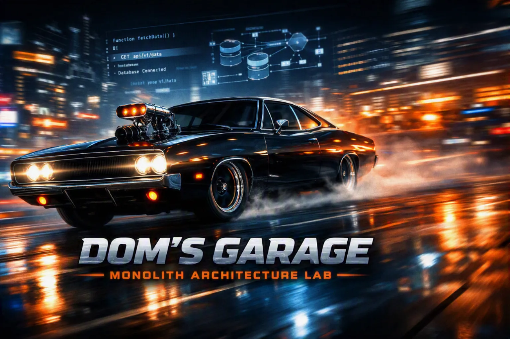

# Module 1: Monolith — Dom's Garage



## Overview

A **monolith** is a single deployable unit: one codebase, one build artifact, one database, one deployment. All application logic (controllers, services, data access) live in a single project and it all ships together. It is not a legacy anti-pattern. For a problem that fits in one team's head, with modest traffic and a bounded scope, a monolith is often the clearest and most productive choice available.

Module 1 teaches the monolith by making its defining characteristics *visible and tangible*. You will review a real codebase with a flat folder structure, a single shared DBContext, and direct in-process method calls between services. The architecture is deliberately unadorned: no interfaces over service,s no repository pattern, no module boundaries. What you see is what the monolith is.

The hands-on lab seals the lesson. You will extend the running application by adding a complete feature (model, database migration, service, and API endpoints) in approximately 30 minutes. That experience of **frictionless extension** is the point. The debrief then asks: *What starts to worry you as Dom's Garage doubles every year?*

---

## What We Are Building: Dom's Garage

Dom's Garage is a small,s ingle-location auto repair shop. The scaffold application is a working ASP.NET Core Web API that manages four entities:

| Entity     | Purpose                                                      |
| ---------- | ------------------------------------------------------------ |
| `Car`      | The core object that is tracked from intake through ready-for-pickup |
| `Mechanic` | Who does the work; includes the name and specialty           |
| `Job`      | Work assigned to a car and a mechanic, with open/closed status |
| `Part`     | Basic parts inventory to include name, stock quality, and unit cost |

**Lab:** You will work on a new feature that adds the `ServiceRecord` entity. This does not exist in the scaffold; you will build it from scratch, following the exact pattern as the existing entities. The feature is intentionally straightforward: the friction-free addition *is* the lesson.

**Tech Stack:** .NET 10, ASP.NET Core, Entity Framework Core, SQLLite, Swagger/OpenAPI

---

## Module Contents

| Item                                           | Description                                                  |
| ---------------------------------------------- | ------------------------------------------------------------ |
| [Lab Instructions](lab-instructions.md)        | Step-by-step participant lab guide. Covers all five implementation steps (entity → DbContext → migration → service → controller), completion checklist, and troubleshooting table. |
| [Lab Start Solution](lab-start/DomsGarage.sln) | Scaffold codebase which provides the starting point for the lab. This solution contains the four pre-built entities and a clean project structure. You will work from this directory. |
| [Lab End Solution](lab-end/DomsGarage.sln)     | The fully implemented application including `ServiceRecord`, all migrations applied, and all endpoints working. Use this as a reference implementation. |

## Getting Started

### Prerequisites

Participants should have the following installed before the session:

- .NET 10 SDK ([download](https://dotnet.microsoft.com/download))
- A code editor (Visual Studio 2022+, VS Code with C# Dev Kit, or JetBrains Rider)
- EF Core CLI tools: `dotnet tool install --global dotnet-ef`

### Clone the Scaffold

```shell
git clone <repo-url>
cd Sections/1-Monolith/lab-start
dotnet run
```

Open `https://localhost:{port}/swagger` to verify the application is running. The Swagger UI should show endpoints for Cars, Mechanics, Jobs, and Parts.

## What You Will Learn

- What is a monolith and why it is a legitimate architectural choice
- How a single shared DbContext physically represents monolith coupling
- How to extend a monolith feature by feature using the existing pattern
- Where monolith tradeoffs surface as a system grows (deployment atomicity, scaling constraints, coupling risk)
- Why the next module (N-Tier) introduces layered structure as a response to the limits you will observe here