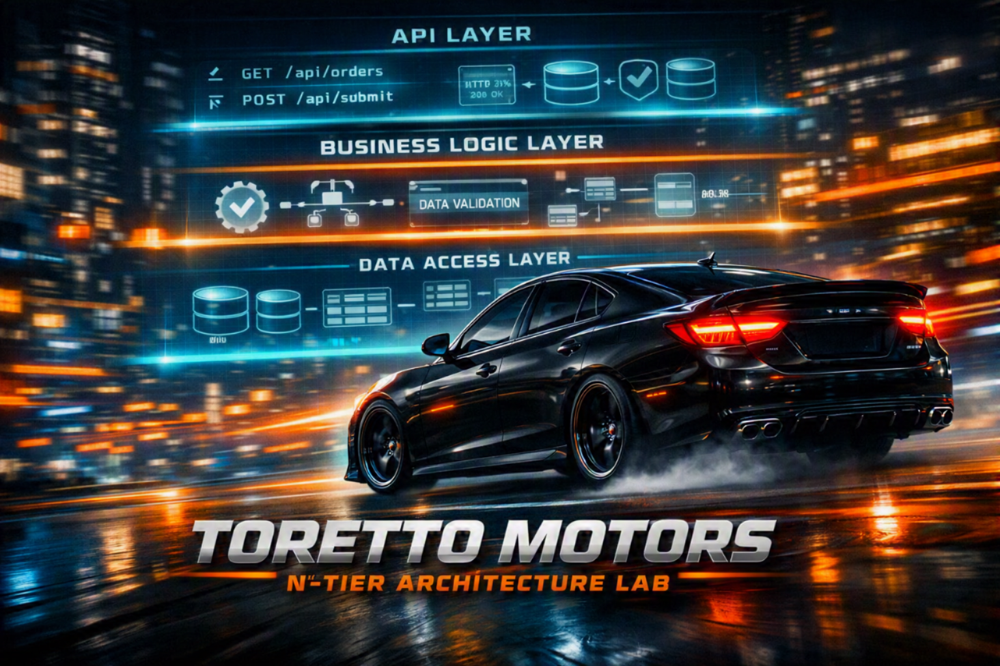

# Module 2: N-Tier — Toretto Motors Maintenance Plans

## Overview

An **N-Tier architecture** organizes an application into distinct horizontal layers, each with a specific responsibility: presentation, business logic, and data access. Layers depend only on layers below them, never above. This structure enforces separation of concerns and makes the application easier to test, scale, and maintain as it grows.

Module 2 builds on Module 1's monolith experience by introducing layering. You will examine **Toretto Motors**, a growing dealership chain, organized into layers: API layer (HTTP endpoints), Business Logic Layer (domain rules and validation), and Data Access Layer (Entity Framework). The hands-on lab asks participants to complete the `MaintenancePlan` feature by enhancing the service logic and exposing it through properly designed API endpoints, all while respecting layer boundaries and dependency rules.

The exercise surfaces two key lessons: first, the clarity of layering (each concern has a clear home) and second, the emerging friction of coordination across layers. The debrief then asks: *"As Toretto Motors' team grows, how do we separate work by feature instead of just by technical layer?"* This question sets up Module 3.

---

## What We're Building: Toretto Motors Maintenance Plans

**Toretto Motors** is a dealership chain with three teams: UI, Backend (Business Logic), and Database. The scaffold includes pre-built entities (Customer, Vehicle, Part, Invoice) and a partially scaffolded `MaintenancePlan` feature.

The key architectural principle from Module 1 is now enforced structurally:

| Layer | Responsibility |
|---|---|
| **API Layer** | HTTP endpoints; request/response serialization; thin controllers |
| **Business Logic Layer (BLL)** | Domain rules; validation; feature orchestration |
| **Data Access Layer (DAL)** | Database queries; repositories; Entity Framework; migrations |

**The constraint:** API calls BLL. BLL calls DAL. DAL never calls BLL. This dependency rule is enforced by project structure; attempting to add upward references causes a build failure.

The lab task: Validate and complete the `MaintenancePlan` business logic (ensure pricing rules, date validation, renewal flow), then expose it through the API layer.

**Tech stack:** .NET 10, ASP.NET Core, Entity Framework Core, SQLite, Swagger/OpenAPI

---

## Module Contents

| Item | Description |
|---|---|
| [Lab Instructions](lab-instructions.md) | Step-by-step participant lab guide. Covers validating BLL logic, implementing renewal methods, exposing API endpoints, and verifying end-to-end behavior. |
| [Lab Start Solution](lab-start/) | Scaffold codebase that provides the starting point for the lab. |
| [Lab End Solution](lab-end/) | The fully implemented application. |

---

## Getting Started

**Prerequisites — participants should have the following installed before the session:**
- .NET 10 SDK ([download](https://dotnet.microsoft.com/download))
- A code editor (Visual Studio 2022+, VS Code with C# Dev Kit, or JetBrains Rider)
- EF Core CLI tools: `dotnet tool install --global dotnet-ef`

Refer to the [Lab Instructions](lab-instructions.md) for step-by-step setup and implementation guidance. The lab walks you through validating MaintenancePlan business logic in the BLL, implementing the necessary service methods, and exposing them cleanly through thin controller actions.

## What you'll learn

- What N-Tier architecture is and how layering organizes concerns
- How dependency rules between layers enforce architectural boundaries
- How to design business logic that is independent of both presentation and data access
- How to expose behavior through thin API controllers
- Where coordination costs emerge when teams work across layers and why the next module (Modular Monolith) explores decomposing by feature instead
