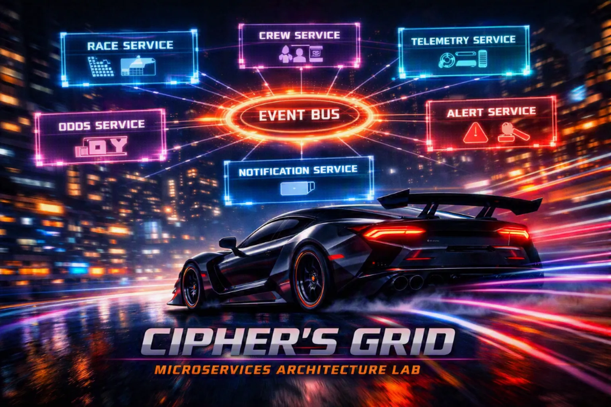

# Module 4: Microservices — Cipher's Grid (Alert Service)



## Overview

A **Microservices architecture** distributes a system into independently deployable services, each owning its domain logic and data. Services communicate across process boundaries through synchronous APIs (HTTP/gRPC) or asynchronous messaging (event bus). This structure enables extreme scalability, technology heterogeneity, and independent team ownership — but introduces operational complexity, distributed tracing, resilience patterns, and eventual consistency.

Module 4 builds on the modular decomposition from Module 3 by making modules truly independent: each feature now runs as its own service with its own database, API, and deployment lifecycle. Participants explore **Cipher's Grid**, a real-time racing analytics platform, where services communicate asynchronously via an event bus. The hands-on lab asks participants to build the **Alert Service**, a new microservice that subscribes to racing events from other services, transforms them into structured alerts, and logs them to its own database—experiencing the isolation and resilience that microservices provide.

The exercise exposes the real tradeoffs: independent scaling and deployment, but at the cost of network latency, eventual consistency, and operational overhead. The debrief consolidates the journey: *"You started with a single monolith. Now each feature is its own service. What did we gain? What did we lose?"* This capstone reflects the entire day's learning.

---

## What We're Building: Cipher's Grid Racing Platform

**Cipher's Grid** is a global real-time racing analytics platform with multiple independently deployable services:

| Service | Responsibility | Database | Lab Status |
|---|---|---|---|
| **Race Service** | Race event management and penalties | Separate per service | ✅ Pre-built |
| **Crew Service** | Team and vehicle roster data | Separate per service | ✅ Pre-built |
| **Telemetry Service** | Live car telemetry streaming | Separate per service | ✅ Pre-built |
| **Odds Service** | Live odds calculation | Separate per service | ✅ Pre-built |
| **Notification Service** | Fan alerts and updates | Separate per service | ✅ Pre-built |
| **Alert Service** | Structured event alerting | Separate per service | 🚧 Participant builds this |

Each service:
- Owns its data model and database (no shared schema)
- Exposes a REST API (Swagger/OpenAPI)
- Subscribes to relevant events from a central message bus (RabbitMQ or Azure Service Bus)
- Can be deployed, scaled, and updated independently
- Runs in its own Docker container

**The lab task:** Implement the **Alert Service** by building an event handler that subscribes to `CrewPenaltyEvent`, transforms it into an alert, and stores it in the service's own database. This demonstrates asynchronous, event-driven communication across service boundaries.

**Tech stack:** .NET 10, ASP.NET Core, Entity Framework Core, SQLite or PostgreSQL, Swagger/OpenAPI, RabbitMQ/Azure Service Bus (message bus), Docker for containerization

---

## Module Contents

| Item | Description |
|---|---|
| [Lab Instructions](lab-instructions.md) | Step-by-step participant lab guide. Covers building the Alert Service, implementing the event handler, storing alerts in the service's database, and verifying end-to-end event flow. |
| [Lab Start](lab-start/) | Scaffold codebase which provides the starting point for this lab. |
| [Lab End](lab-end) | The fully implemented application including the Penalties feature built during the lab. |

---

## Key Architectural Patterns

### Event-Driven Communication (Asynchronous)

Services publish events to a message bus; interested services subscribe:

```csharp
// Race Service publishes
var penaltyEvent = new CrewPenaltyEvent { RaceId = 1, DriverId = 42, Reason = "Speeding" };
await eventBus.PublishAsync(penaltyEvent);

// Alert Service subscribes
eventBus.Subscribe<CrewPenaltyEvent>(async msg =>
{
    var alert = new Alert { RaceId = msg.RaceId, DriverId = msg.DriverId, ... };
    await alertRepository.CreateAsync(alert);
});
```

**Key insight:** Services don't call each other's APIs directly. Events flow through the message bus. Subscribers can be down (and catch up later) without affecting publishers.

### Database per Service (Data Isolation)

Each service owns its database — no shared schema:

```csharp
// Race Service
var raceDb = new RaceDbContext(
    connectionString: "Server=localhost;Database=race_db");

// Alert Service
var alertDb = new AlertDbContext(
    connectionString: "Server=localhost;Database=alert_db");
```

To access another service's data, you query its API or subscribe to its events — never direct database access.

### Independent Deployment & Scaling

```bash
# Scale Alert Service to 5 instances
docker-compose up -d --scale alert-service=5

# Deploy new Race Service version (Alert keeps running)
docker-compose pull race-service && docker-compose up -d race-service
```

Each service has its own deployment pipeline. One team's release doesn't block another's.

---

## Getting Started

**Prerequisites — participants should have the following installed before the session:**
- .NET 10 SDK ([download](https://dotnet.microsoft.com/download))
- A code editor (Visual Studio 2022+, VS Code with C# Dev Kit, or JetBrains Rider)
- EF Core CLI tools: `dotnet tool install --global dotnet-ef`
- Docker Desktop ([download](https://www.docker.com/products/docker-desktop)) — required for service orchestration
- Git (for cloning the scaffold repository)

**Get started:**

Refer to [Lab Instructions.md](lab-instructions.md) for step-by-step setup. Start the Cipher's Grid platform locally using docker-compose, then implement the Alert Service by building the event handler and verifying alerts flow end-to-end from the Race Service through the message bus to your Alert Service database.

**What you'll learn:**

- What a Microservices architecture is and how services decompose by business domain
- How event-driven communication decouples services across process boundaries
- How services achieve isolation, scalability, and independent deployment
- How each service owns its data and schema
- The operational complexity introduced by distributed systems: eventual consistency, failure modes, observability, and orchestration
- How to weigh microservices tradeoffs against the simplicity of monolithic architectures

---

*One Day, Four Architectures — Module 4: Microservices*
